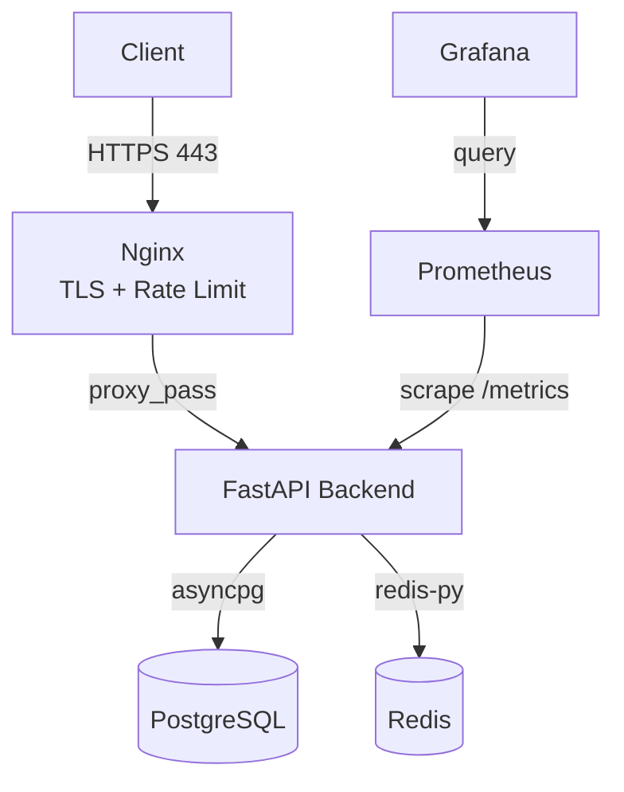

# Docker Compose Production-Like Stand

Локальный стенд, имитирующий production-окружение для тестирования микросервисов.

## Архитектура



## Стек

- **Backend:** FastAPI (Python 3.11), non-root user
- **БД:** PostgreSQL 16
- **Кеш:** Redis 7
- **Reverse Proxy:** Nginx 1.25 (TLS, rate limit 10 r/s, security headers)
- **Мониторинг:** Prometheus 2.51 + Grafana 10.4 (auto-provisioned dashboard)

## Быстрый старт

```bash
# 1. Копируем переменные окружения
cp .env.example .env

# 2. Поднимаем стенд (сертификаты сгенерируются автоматически)
make up

# 3. Проверяем
make check
```

## Эндпоинты

Все запросы идут через Nginx по HTTPS:

| Метод | URL                          | Описание                                |
|-------|------------------------------|-----------------------------------------|
| GET   | `https://localhost/`         | Информация о сервисе                    |
| GET   | `https://localhost/health`   | Liveness probe                          |
| GET   | `https://localhost/ready`    | Readiness probe (проверяет БД + Redis)  |
| GET   | `https://localhost/metrics`  | Метрики Prometheus                      |

> 

Backend **намеренно недоступен** снаружи на порту 8000 — все запросы идут через Nginx на 443.

## Мониторинг

| Сервис         | URL                       | Логин / Пароль |
|----------------|---------------------------|----------------|
| **Prometheus** | http://localhost:9090     | —              |
| **Grafana**    | http://localhost:3000     | admin / admin  |

**Дашборд `App Overview`** (auto-provisioned) содержит панели:

- **RPS** — requests per second по хендлерам
- **Latency p95** — 95-й перцентиль времени ответа
- **Errors 5xx** — частота ошибок сервера
- **Backend Memory (RSS)** — потребление памяти процессом

## Безопасность

- **TLS** с TLSv1.2 / TLSv1.3, self-signed сертификат
- **Rate limit** 10 req/s с burst 20
- **`client_max_body_size`** 10 MB — защита от переполнения
- **Security headers:** `X-Frame-Options`, `X-Content-Type-Options`, `X-XSS-Protection`, `HSTS`
- **`server_tokens off`** — версия Nginx скрыта от сканеров
- **Non-root user** в backend-контейнере
- **`.env` не коммитится** — секреты локальны

## Полезные команды

| Команда             | Что делает                                 |
|---------------------|--------------------------------------------|
| `make up`           | Собрать и запустить всё (+ генерация certs)|
| `make down`         | Остановить контейнеры                      |
| `make down-v`       | Остановить + удалить volumes (сброс БД)    |
| `make logs`         | Логи всех сервисов                         |
| `make logs-prom`    | Логи Prometheus                            |
| `make logs-grafana` | Логи Grafana                               |
| `make ps`           | Статус контейнеров                         |
| `make check`        | Проверить эндпоинты через HTTPS            |
| `make certs`        | Сгенерировать self-signed сертификаты      |
| `make urls`         | Показать все URL'ы сервисов                |
| `make clean`        | Полная очистка (контейнеры + volumes)      |

## Структура проекта

```
docker-compose-prod-stand/
├── app/                    # FastAPI backend
│   ├── main.py
│   ├── requirements.txt
│   ├── Dockerfile
│   └── .dockerignore
├── nginx/
│   ├── nginx.conf          # Reverse proxy + TLS + rate limit
│   ├── generate-certs.sh
│   └── certs/              # (gitignored)
├── prometheus/
│   └── prometheus.yml
├── grafana/
│   ├── provisioning/
│   │   ├── datasources/
│   │   └── dashboards/
│   └── dashboards/
│       └── app.json
├── docker-compose.yml
├── Makefile
├── .env.example
└── README.md
```

## Проверка работы

```bash
# Health / Ready / Root
make check

# Метрики
curl -k https://localhost/metrics | head -20

# Дашборд Grafana
open http://localhost:3000     # admin / admin
```


MIT
